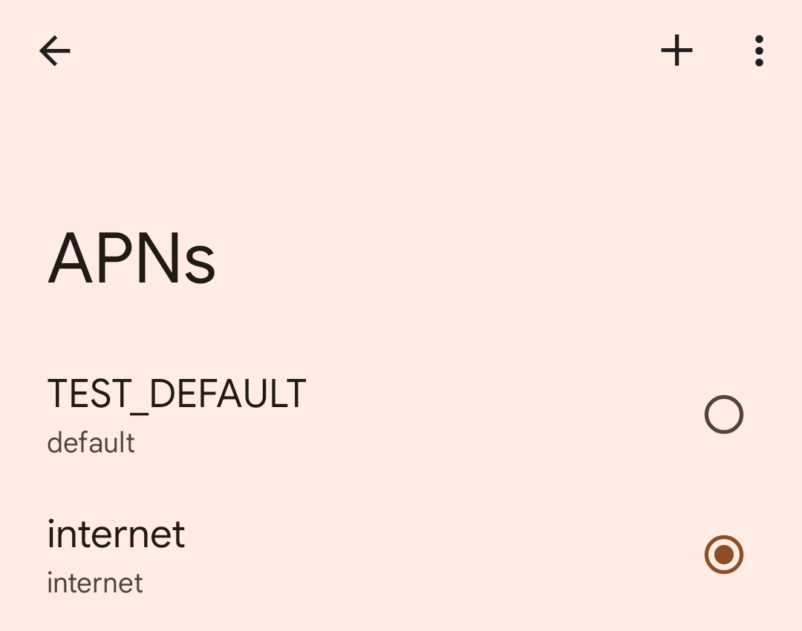
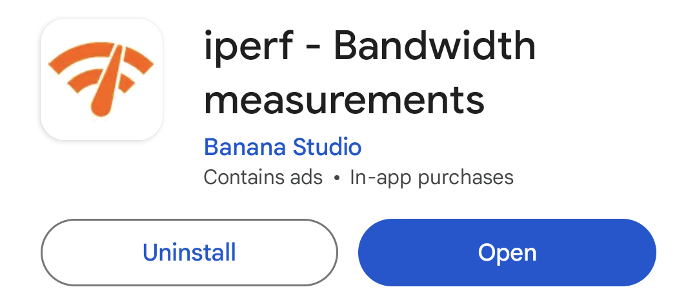
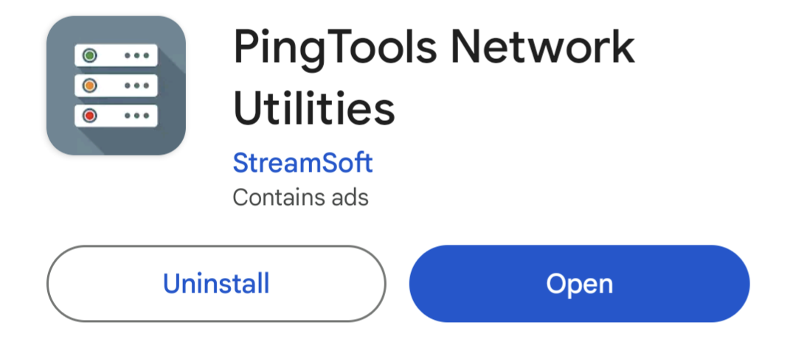
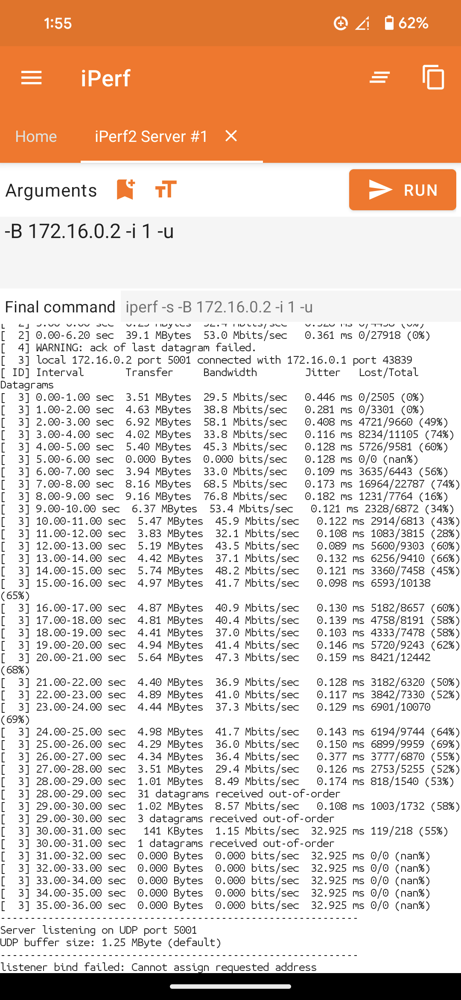
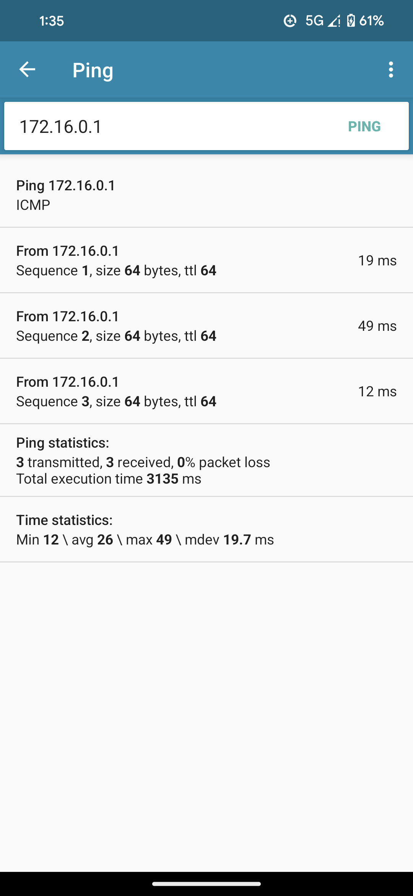
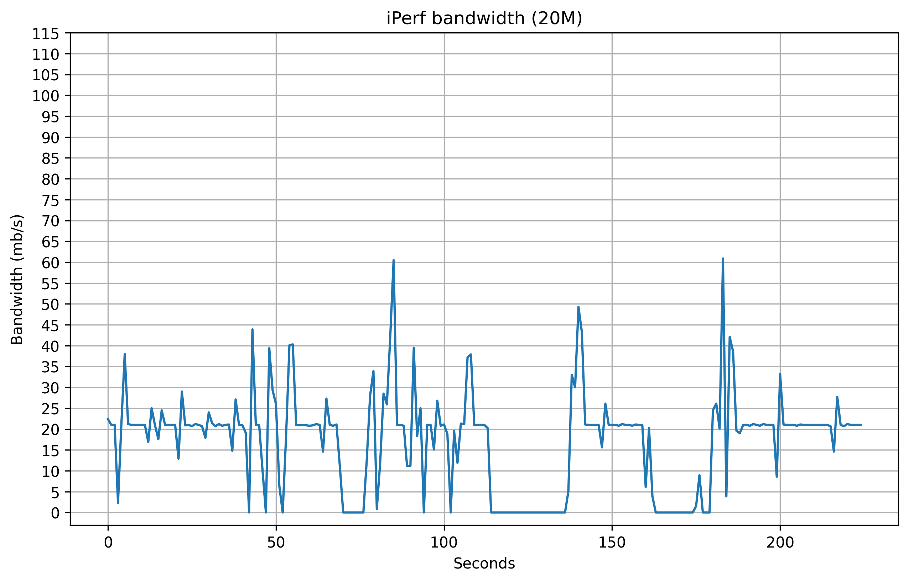
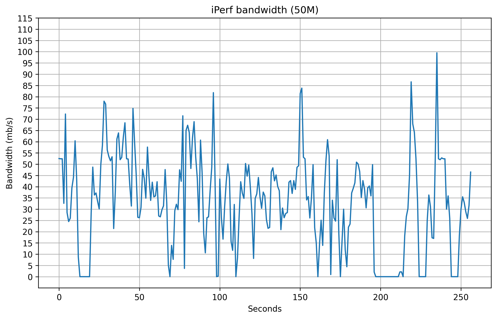
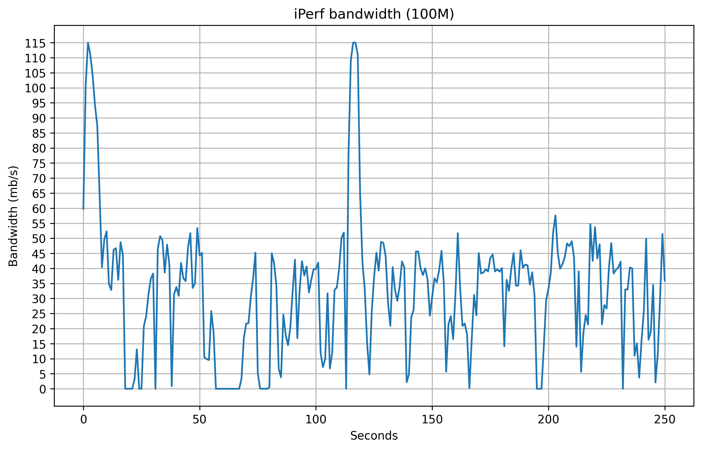
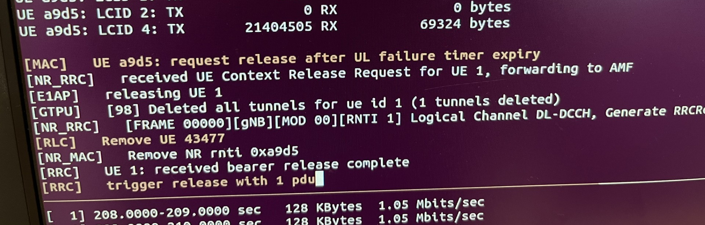
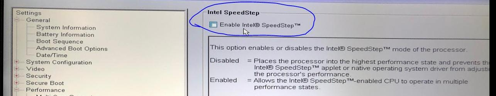

<style>
    .slider {
      position: relative;
      width: 100%; /* Make the slider container full-width */
      max-width: 800px; /* Increase the maximum width */
      margin: auto;
      overflow: hidden;
    }

    .slides {
      display: flex;
      transition: transform 0.5s ease-in-out;
    }

    .slide {
      min-width: 100%;
      box-sizing: border-box;
    }

    .slide img {
      width: 100%; /* Make images responsive to the slider width */
    }

    .caption {
      text-align: center;
      font-size: 16px; /* Increase caption font size */
      color: #333;
      padding: 10px 0; /* Increase padding for better spacing */
    }

    button {
      position: absolute;
      top: 50%;
      width: 50px; /* Increase button size */
      height: 50px; /* Increase button size */
      background-color: rgba(0,0,0,0.5);
      color: white;
      border: none;
      cursor: pointer;
      font-size: 30px; /* Increase font size for arrows */
      display: flex;
      align-items: center;
      justify-content: center;
      transform: translateY(-50%);
      opacity: 0.5; /* Default opacity */
      transition: opacity 0.3s, background-color 0.3s; /* Smooth transitions */
      border-radius: 5px; /* Optional: Add rounded corners to buttons */
    }

    button:hover {
      opacity: 1; /* Full opacity on hover */
      background-color: rgba(0,0,0,0.7); /* Darker background on hover */
    }

    .prev {
      left: 10px; /* Adjust left position */
    }

    .next {
      right: 10px; /* Adjust right position */
    }
  </style>
  
# COTS UE for AERPAW (exploring alternatives)

> ❗ We have to run the following two programming commands before we run the Open5GS container

## Opencells SIM programming

```bash
sudo ./program_uicc --adm 11405625 --imsi 001010000088516  --isdn 00000001 --acc 0040 --key 8EAE4E0E5BFAC60B65E192581234D02A --opc 9CA4C48F83E123270B66E31FF68FB289 -spn "OpenAirInterface" --authenticate
```

## Pysim SIM programming

```bash
./pySim-prog.py -p0 -s 8988211000000885163 -x 001 -y 01 -a 11405625 --imsi=001010000088516 --opc=9CA4C48F83E123270B66E31FF68FB289 --msisdn=00000001 --acc 0040 -k 8EAE4E0E5BFAC60B65E192581234D02A -n "OpenAirInterface"
```

## Check for the `dnn` parameter in Open5GS config file:

> 📁 Config filepath: `/opt/open5gs/build/configs/open5gs_nr_core_oai.yaml`

Look for the `dnn` parameter under SMF & UPF, which should match with the `APN` of the SIM card.




> ⚠️ Make sure both the name and APN are exactly the same

# How to run

## 1) Start the docker container:

```bash
sudo docker run -it --privileged -v /dev/bus/usb:/dev/bus/usb --net host --cap-add=NET_ADMIN --cap-add=SYS_NICE 7ea939d733c6 /bin/bash
```

## 2) Initiate a TMUX session and start Open5GS:

```bash
cd ~/Profiles/ProfileScripts/Radio/Helpers
./startOpen5GS.sh /opt/open5gs/build/configs/open5gs_nr_core_oai.yaml
```

## 3) Add SIM parameters to the Open5GS database:

```bash
/opt/open5gs/build/misc/db/open5gs-dbctl add 001010000088516 8EAE4E0E5BFAC60B65E192581234D02A 9CA4C48F83E123270B66E31FF68FB289
```

## 4) Open a second TMUX session and start gNB:

```bash
cd ~/Profiles/ProfileScripts/Radio/Helpers
export LAUNCH_MODE=TESTBED
./start_OAI_gNB.sh
```

## 5) Run network performance tests:

For the purpose of testing, we used the following apps:
<br>
<div style="display: flex; gap: 10px;">
  
  
</div>
<br>
### Traffic results:

<div style="display: flex; gap: 10px;">
  
  
</div>
<br>


### Graph:

<div class="slider">
    <button class="prev" onclick="moveSlide(-1)">&#10094;</button>
    <div class="slides">
      <div class="slide">
        <figure>
          
          <figcaption class="caption">Graph #1: 20M</figcaption>
        </figure>
      </div>
      <div class="slide">
        <figure>
          
          <figcaption class="caption">Graph #2: 50M</figcaption>
        </figure>
      </div>
      <div class="slide">
        <figure>
          
          <figcaption class="caption">Graph #3: 100M</figcaption>
        </figure>
      </div>
    </div>
    <button class="next" onclick="moveSlide(1)">&#10095;</button>
  </div>
  
  <script>
    let currentSlide = 0;

    function moveSlide(step) {
      const slides = document.querySelector('.slides');
      const totalSlides = document.querySelectorAll('.slide').length;
      
      currentSlide = (currentSlide + step + totalSlides) % totalSlides;
      slides.style.transform = `translateX(-${currentSlide * 100}%)`;
    }
  </script>

## Possible issues
    
We previously faced an issue where the connection would disconnect within 60 seconds, even though the COTS UE was right in front of the USRP. The specific error we encountered was `Request release after UL failure timer expiry`.
    


    
We  did the following to solve the disconnection issues:

1. Dial `*#*#0702#*#*`.
2. Change `NR_TIMER_WAIT_IMS_REGISTRATION` to -1 to prevent IMS registration from timing out, ensuring uninterrupted service without unnecessary retries.
3. Change the value of `SUPPORT_IMS_NR_REGISTRATION_TIMER` from 1 to 0 to disable the timer, removing its role in IMS NR registration.
    
For full reference, check the [official guide](https://gitlab.eurecom.fr/oai/cn5g/oai-cn5g-fed/-/blob/master/docs/LIST_OF_TESTED_COTSUE.md).
    
## Performance Tuning
  

We also recommend that users disable SpeedStep from the BIOS menu.
